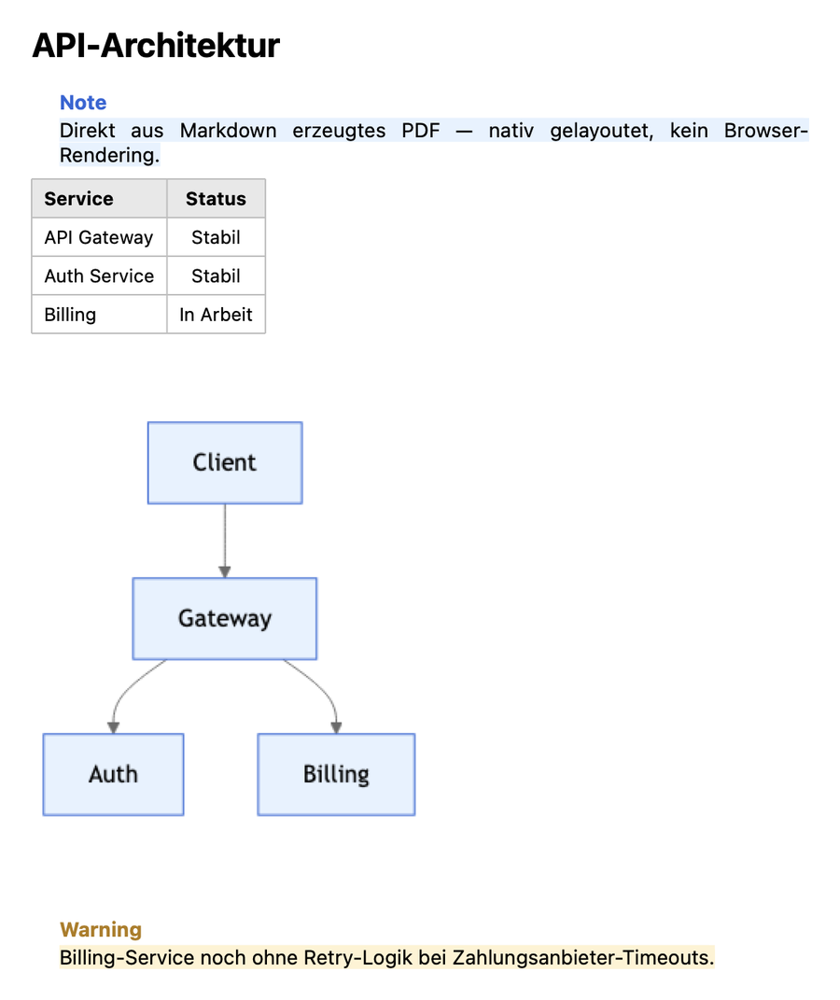

# MarkdownDocumentKit


A native Swift package that lays out Markdown as an actual structured
document — tables, callout boxes (`> [!NOTE]`-style), headings, lists, and
embedded images — and renders the result to PDF, DOCX, or a plain
`NSAttributedString`, without a browser engine or an external typesetting
binary.



*A real `PDFRenderer.render` output — heading, table, and both callout
boxes need zero configuration (see "Quick start" below); the diagram
needs an injected `DiagramRenderer`, here one that maps `DiagramPalette`
into Mermaid's own theming hook so it matches the callouts' colors
instead of Mermaid's unrelated stock purple (see "Injecting math, images,
and diagrams" below). Nothing in this screenshot is hand-drawn or
touched up.*

## Quick start

```swift
import Foundation
import MarkdownDocumentKit

let markdown = """
# Quarterly Report

> [!NOTE]
> Auto-generated summary — figures are provisional until close.

| Metric | Q1 | Q2 |
| --- | --- | --- |
| Revenue | 12k | 15k |
"""

let blocks = DocumentParser.parse(markdown)
let attributed = DocumentRenderer.attributedString(from: blocks, title: "Quarterly Report")

let pdfData = try PDFRenderer.render(attributed)
try pdfData.write(to: URL(fileURLWithPath: "report.pdf"))
```

That's the whole PDF path — no setup, no injected renderers, nothing to
configure. Want a `.docx` instead, with a real, editable Word table (not
a picture of one)?

```swift
let docxData = try WordDocumentExporter.export(blocks, title: "Quarterly Report")
try docxData.write(to: URL(fileURLWithPath: "report.docx"))
```

`WordDocumentExporter` (AppKit-only — see "Known limitations") still goes
through AppKit's own `.officeOpenXML` writer for everything else in the
document, but hand-writes the `<w:tbl>` XML for each table itself and
splices it in afterward. That's not a stylistic choice: a real
`NSTextTable`/`NSTextTableBlock` structure — the "correct", built-in way
to ask AppKit's text system for a table — turns out to get silently
dropped by that specific writer (confirmed by writing the same source to
`.rtf` instead, where it *does* come out as a real table — this is an
`.officeOpenXML`-writer gap specifically, not the wrong way to ask). If
you don't have any tables, or don't care whether they end up as an image,
plain `attributedString(from:...)` still round-trips through that same
writer directly:

```swift
let attributed = DocumentRenderer.attributedString(from: blocks, title: "Quarterly Report")
let docxData = try attributed.data(
    from: NSRange(location: 0, length: attributed.length),
    documentAttributes: [.documentType: NSAttributedString.DocumentType.officeOpenXML]
)
```

Math, images from a path/URL, and Mermaid diagrams need one more step —
see "Injecting math, images, and diagrams" below — but everything else
(tables, callouts, lists, code blocks, headings) works with zero
configuration.

## Why this exists

Turning "Markdown a model wrote" into a document worth saving as a file
means handling more than headings and bold text: real study notes and
reports have tables, callout/warning boxes, and diagrams. The two usual
routes to get there both cost more than the problem is actually worth:

- A full **LaTeX engine** (even a modernized, self-contained one) needs a
  large package/font universe — its default bundle is multiple GB, and
  building your own trimmed-down offline bundle is real, ongoing
  maintenance, not a one-time step.
- A **browser engine + JS libraries** (Mermaid, KaTeX, a Markdown-to-HTML
  pipeline) works, but is a lot of moving parts for content that's actually
  a bounded, well-known set of block-level constructs.

MarkdownDocumentKit takes the same middle path
[TeXEnvironments](../TeXEnvironments) takes for formulas: implement the
specific handful of constructs that matter (tables, callouts,
headings/lists, images) as real layout code on top of CoreText/CoreGraphics,
instead of reaching for something built to handle *any* document.

## Injecting math, images, and diagrams

This package has **zero dependencies** — on purpose. It doesn't know what
SwiftMath, WKWebView, or `URLSession` are. Three block types each hand off
to a small protocol the *consumer* implements, so a consumer that doesn't
care about (say) math isn't forced to pull in a math-typesetting stack
just to lay out a table. Every one of them is optional: without it, that
block type falls back to showing its raw source/alt text rather than a
blank gap.

**`FormulaRenderer`** — a `\[...\]`/`$$...$$`/`$...$`/`\(...\)` formula,
typically backed by SwiftMath for single equations and
[TeXEnvironments](../TeXEnvironments) for multi-line environments/matrices:

```swift
struct MyFormulaRenderer: FormulaRenderer {
    func image(forLaTeX latex: String, displayMode: Bool, fontSize: CGFloat) -> FormulaImage? {
        // Typeset `latex` with your own math renderer (e.g. SwiftMath's
        // MTMathUILabel), rasterize it, and return the image plus its
        // descent so an inline formula sits on the right baseline.
    }
}
```

**`ImageRenderer`** — a `` whose `source` is a local path or
remote URL (a `data:image/...;base64,...` source needs no renderer at all,
this package decodes it directly):

```swift
struct MyImageRenderer: ImageRenderer {
    func image(forSource source: String, altText: String) -> PlatformImage? {
        // Resolve `source` yourself (disk read, URLSession fetch, cache
        // lookup) and return the decoded image.
    }
}
```

**`DiagramRenderer`** — a fenced ` ```mermaid ` block, typically backed by
a hidden `WKWebView` running mermaid.js, screenshotted once layout
settles (no native Swift port of Mermaid exists, so this is the one piece
that inherently needs a small JS context):

```swift
struct MyDiagramRenderer: DiagramRenderer {
    func image(forMermaidSource source: String, palette: DiagramPalette) -> PlatformImage? {
        // Feed `palette`'s colors into mermaid.js's own theming hook
        // (e.g. a %%{init: {'theme':'base', 'themeVariables': {...}}}%%
        // directive) so the rendered diagram matches your DocumentTheme
        // instead of Mermaid's unrelated stock purple.
    }
}
```

Pass whichever ones you need to `DocumentRenderer.attributedString`:

```swift
let attributed = DocumentRenderer.attributedString(
    from: blocks,
    title: "Quarterly Report",
    formulaRenderer: MyFormulaRenderer(),
    imageRenderer: MyImageRenderer(),
    diagramRenderer: MyDiagramRenderer()
)
```

## Styling is injected too — bring your own brand

Every color, font size, and spacing value `DocumentRenderer`/`TableRenderer`
use comes from a `DocumentTheme` — an optional parameter defaulting to
`.default`, which reproduces this package's original hardcoded look exactly,
so an existing consumer that never asks for a theme sees zero change:

```swift
var theme = DocumentTheme.default
theme.tableBorder = .systemOrange
theme.codeBlockBackground = .systemPurple
theme.calloutTints[.warning] = DocumentTheme.CalloutTint(background: .yellow, accent: .brown)
theme.headingFontSizes = [28, 22, 18, 16, 14, 12]

let attributed = DocumentRenderer.attributedString(from: blocks, title: title, theme: theme)
```

Overriding one field (or one callout kind) leaves everything else at its
default — no need to restate the whole theme to change a single color.
Deliberately *not* stretched to cover font *family* — see "Known
limitations" below, and `DocumentTheme.swift`'s own doc comment for why.

## Known limitations

- **Apple-only.** AppKit/CoreText/CoreGraphics on macOS 13+ and iOS 16+ —
  no Linux, Windows, or Android, and that's not on the roadmap; it's the
  whole point of not reaching for a browser engine.
- **No font-family theming.** `DocumentTheme` covers color/size/spacing;
  every glyph is a system-font regular/bold/italic/monospaced variant —
  see `DocumentTheme.swift`'s own doc comment for why (letting a consumer
  swap in an arbitrary custom typeface would mean re-deriving bold/italic
  synthesis for that typeface too, a real feature of its own).
- **`WordDocumentExporter` is AppKit-only.** Like the rest of DOCX support
  in this package — `.data(from:documentAttributes:)` for `.officeOpenXML`
  isn't available on UIKit at all, so there was never a cross-platform
  DOCX path to begin with. `attributedString(from:...)`/`PDFRenderer`
  stay fully cross-platform.
- **Math and diagrams need your own renderer.** Without a `FormulaRenderer`/
  `DiagramRenderer`, a formula or Mermaid diagram falls back to its raw
  source text, not a rendered result — this package has zero dependencies
  and does no JS/typesetting on its own.
- **Markdown support is a bounded subset, not full CommonMark.** The block
  types this package handles (headings, paragraphs, lists, task lists,
  tables, callouts, code blocks, images, formulas, diagrams, footnotes)
  are deliberately the common case a document-export feature actually
  needs — see "Why this exists" above for the reasoning. Notably absent:
  an automatically generated table of contents (see
  [ARCHITECTURE.md](ARCHITECTURE.md) for why it's a meaningfully bigger
  undertaking than the rest of this list, not just an oversight) — not
  currently planned, but if you need it, open an issue.

## Status

Phases 1 through 7, plus images, theme injection, and Mermaid diagrams,
done and in real production use by a consuming app's document-export
feature. For the implementation history and design rationale behind each
piece — including the real bugs that shaped it — see
[ARCHITECTURE.md](ARCHITECTURE.md).

## Versioning

Tagged releases follow [SemVer](https://semver.org). Currently pre-1.0
(`0.x`) — per SemVer's own convention, that means a breaking API change
(a protocol's required method signature changing, a public type's fields
changing) can still land in a minor bump, not necessarily a major one.
`DiagramRenderer.image(forMermaidSource:)` gaining a required `palette`
parameter is exactly that kind of change. Once this reaches `1.0.0`, a
breaking change becomes a major bump.

## Requirements

- Swift 5.10+
- iOS 16+ / macOS 13+ — enforced by `Package.swift`'s `platforms:` declaration,
  which every CI job already builds and tests against (see
  [ARCHITECTURE.md](ARCHITECTURE.md) for what that guarantees and what it
  doesn't — no iOS 16 simulator is actually runnable in CI anymore, only
  the deployment-target availability check itself).

## License

MIT — see [LICENSE](LICENSE).
